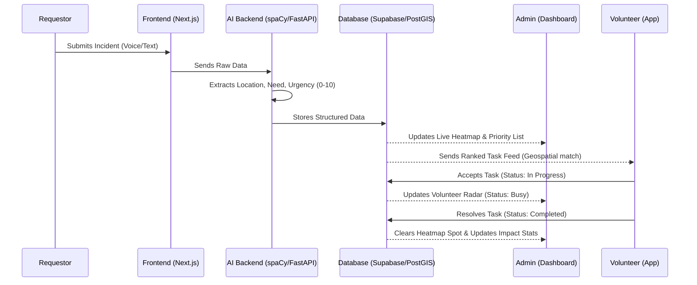
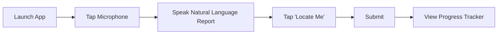
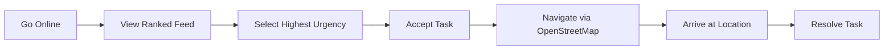

# VolunteerIQ (MVP)

**Project Goal:** To reduce crisis response lag from days to 15 minutes by connecting scattered community needs to the right volunteers using AI-driven urgency scoring and geospatial matching.

## 🏗️ Core Technology Stack (100% Forever-Free)

| Component | Technology | Why This? |
| :--- | :--- | :--- |
| **Frontend** | Next.js + Vanilla CSS | Fast development; one codebase for all 3 views. |
| **Backend** | FastAPI + Python | 
| **Deployment** | Vercel | Permanently free for hobbyist/hackathon projects. |
| **Database** | Supabase (Free Tier) | Includes PostGIS for free geospatial (location) queries. |
| **Maps** | Leaflet.js + OpenStreetMap | No API keys, no credit cards, no usage limits. |
| **NLP Engine** | spaCy (on FastAPI) | Open-source Python library to score text urgency. |
| **Backend Host** | PythonAnywhere (Free) | Hosts your Python AI logic for $0. |

## 👥 Interfaces

### 1. Requestor Interface (Community / Field Worker)
**Objective:** Capture data in the simplest way possible to feed the AI engine.

*   **Smart Report Field:** A single text-entry box that accepts "natural language" (e.g., "Food shortage in Ward 5, 20 people waiting").
*   **Voice-to-Text Ingestion:** A browser-integrated microphone button for recording voice alerts in the field.
*   **"Locate Me" Button:** Uses the browser Geolocation API to pin the exact coordinates without manual typing.
*   **Status Tracker:** A simple visual progress bar (Reported → AI Scored → Volunteer Assigned → Resolved).

### 2. Volunteer Interface (The Rider)
**Objective:** Provide the mobile responder with clear, actionable tasks and navigation.

*   **Urgency-Ranked Task Feed:** A list of nearby tasks sorted by the AI’s urgency score (1–10). High-score tasks appear in red.
*   **One-Click Navigation:** A button that opens the coordinates in OpenStreetMap for turn-by-turn directions.
*   **Status Toggle:** A three-state button system (Accept / Arrived / Complete) that updates the database in real-time.
*   **Availability Switch:** A simple "Go Online/Offline" toggle that tells the backend whether to include this rider in the "Smart Matching" logic.

### 3. Admin Interface (NGO Coordinator)
**Objective:** Provide "visually arresting" situational awareness and automate reporting.

*   **Live Need Heatmap:** A Leaflet.js map that clusters individual reports into hotspots. This shows coordinators where the crisis is most intense.
*   **AI Priority Dashboard:** A sidebar that automatically "surfaces" the Top 3 most urgent needs based on the NLP engine's scoring.
*   **Volunteer Radar:** Real-time icons on the map showing the location and status (Busy/Idle) of all active volunteers.
*   **"One-Click" Impact Generator:** A button to generate a PDF summary of successful dispatches and average response times to show donors.

## 🔄 The Data Flow (The "Winning" Pitch)

1.  **Ingest:** The Requestor submits a voice note on their screen.
2.  **Parse:** The Python Backend (spaCy) transcribes the note, identifies it as a "Medical Emergency," and assigns a score of 9/10.
3.  **Visualize:** The Admin Screen heatmap turns bright red in that specific location.
4.  **Dispatch:** The system queries the Supabase (PostGIS) database for the nearest volunteer with "Medical" skills.
5.  **Action:** The Volunteer Screen vibrates with an "Urgent Task" notification and a map pin.

## 🔀 System Workflows

### End-to-End Incident Resolution

### Requestor Workflow

### Volunteer Workflow

---

## 💡 How It Works (Examples)

VolunteerIQ is a smart coordination system designed to make sure help reaches people in need as fast as possible. Currently, many NGOs waste time on paperwork or lose track of help requests in busy WhatsApp groups. This project uses Artificial Intelligence (AI) to automate that work. In simple terms, think of it as a **"911 Dispatch Center"** for social good.

*   **1. The Request (The "User"):** Instead of a complicated form, someone in need just sends a simple message or a voice note.
    *   *Example:* A field worker records, "We have 10 families in Ward 4 who haven't had food for 2 days."
*   **2. The Brain (The "AI"):** The system "reads" the message. It identifies that it’s about Food, marks it as High Urgency, and finds the exact Location.
    *   *Example:* The AI automatically gives this a priority score of 9/10 because people are starving.
*   **3. The Map (The "Admin"):** The NGO manager sees a live "Heatmap." Instead of reading 100 texts, they just see a bright red glowing spot on the map where the crisis is happening.
    *   *Example:* The manager sees a red cluster in Ward 4 and knows that’s where they must send resources immediately.
*   **4. The Help (The "Volunteer/Rider"):** The system looks for the closest volunteer with a bike and food supplies and sends a notification directly to their phone.
    *   *Example:* A volunteer 500 meters away gets a ping: "Urgent: Deliver food to Ward 4. Click here for the map."

### Why this is better:
*   **Speed:** It cuts down the response time from 2–3 days to just 15 minutes.
*   **Simple:** Volunteers don't need to be tech experts; they just follow the map pins.
*   **Zero Waste:** It ensures a volunteer with medical skills goes to a medical emergency, and a volunteer with a truck goes to move heavy supplies.
